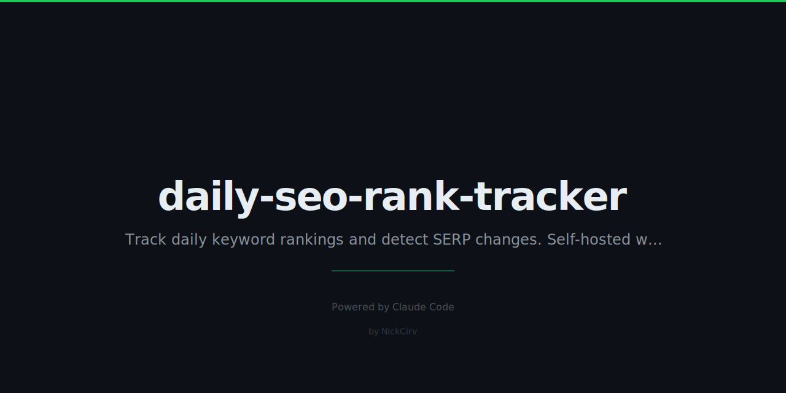

# Daily SEO Rank Tracker - MCP Automated PRD

**Created:** 2026-01-23
**Category:** MCP-AUTOMATED / Intelligence Products
**Status:** 🔴 NEW - High Priority
**Priority:** HIGH - Build This Week

---

## Quick Reference

**What It Is:** Automated daily SERP tracking that monitors keyword rankings and sends alerts on changes

**Revenue:** $500-2,000/month (10-40 customers at $49/mo)

**Build Time:** 3 hours (one-time)

**Automation Level:** 100% automated after setup

**MCP Tools:** `Apify Google Search Scraper` + `xlsx` + Email alerts

---

## How It Works

```
┌─────────────────────────────────────────────────────────────────┐
│ DAILY AUTOMATED PIPELINE                                         │
├─────────────────────────────────────────────────────────────────┤
│                                                                  │
│ 1. SCHEDULE: Cron runs daily at 6 AM                            │
│                                                                  │
│ 2. SCRAPE: For each customer's keyword list                      │
│    → Apify Google Search Scraper                                 │
│    → Get top 100 results per keyword                             │
│    → Extract: position, URL, title, snippet                      │
│                                                                  │
│ 3. COMPARE: Against yesterday's results                          │
│    → Position change detection                                   │
│    → New competitors entering top 10                             │
│    → Lost rankings alerts                                        │
│                                                                  │
│ 4. STORE: Historical data                                        │
│    → xlsx generates tracking spreadsheet                         │
│    → 30/60/90 day trend charts                                   │
│                                                                  │
│ 5. ALERT: Email summary                                          │
│    → Rankings that moved +/- 5 positions                         │
│    → New competitor alerts                                       │
│    → Weekly trend report                                         │
│                                                                  │
└─────────────────────────────────────────────────────────────────┘
```

---

## Implementation Plan

### Phase 1: Core Scraper (1.5 hours)

```javascript
// Apify Google Search Scraper config
{
  "queries": ["keyword 1", "keyword 2", ...],
  "resultsPerPage": 100,
  "maxPagesPerQuery": 1,
  "languageCode": "en",
  "countryCode": "us"
}

// Output processing
// - Find customer's domain in results
// - Extract position (1-100 or "Not in top 100")
// - Store with timestamp
```

### Phase 2: Comparison Engine (1 hour)

```python
# Compare today vs yesterday
def detect_changes(today, yesterday):
    changes = []
    for keyword in today:
        if today[keyword] != yesterday[keyword]:
            change = today[keyword] - yesterday[keyword]
            if abs(change) >= 3:  # Only alert on 3+ position change
                changes.append({
                    "keyword": keyword,
                    "old": yesterday[keyword],
                    "new": today[keyword],
                    "change": change
                })
    return changes
```

### Phase 3: Reporting & Alerts (0.5 hours)

- Email template with changes summary
- Weekly PDF report with trends
- xlsx spreadsheet with full history
- Optional: Slack webhook integration

---

## Pricing

| Tier | Price | Keywords | Updates | Target |
|------|-------|----------|---------|--------|
| **Starter** | $29/mo | 25 keywords | Daily | Freelancers |
| **Pro** | $49/mo | 100 keywords | Daily | Small agencies |
| **Agency** | $99/mo | 500 keywords | Daily | Large agencies |
| **Enterprise** | $249/mo | 2000 keywords | Daily | SEO tools |

---

## Target Market

**Primary Customers:**
- SEO freelancers tracking client keywords
- Small businesses monitoring their rankings
- Marketing agencies with multiple clients
- E-commerce sites tracking product keywords

**Pain Points:**
- Ahrefs/SEMrush too expensive ($99-449/mo)
- Need simple daily tracking without complexity
- Want alerts, not dashboards they have to check
- Need affordable solution for multiple clients

**Value Proposition:**
"Enterprise rank tracking at freelancer prices. $49/mo for 100 keywords with daily alerts."

---

## Competitive Advantage

| Feature | Us | Ahrefs | SEMrush |
|---------|-----|--------|---------|
| Price (100 keywords) | $49/mo | $99/mo | $119/mo |
| Daily updates | ✓ | Weekly | Every 3 days |
| Email alerts | ✓ | ✓ | ✓ |
| Setup time | 5 min | Complex | Complex |
| White-label | Coming | $449/mo | Enterprise |

---

## Marketing

**Launch Strategy:**

1. **Reddit r/SEO** - "I built a rank tracker for $49/mo because Ahrefs is too expensive. Looking for beta testers."

2. **Indie Hackers** - Build in public thread: "Week 1: Building a rank tracker to compete with Ahrefs"

3. **SEO Facebook Groups** - "Free rank tracking for 30 days. Need 20 beta testers."

**First 10 Customers:**
- Free 30-day trial with full features
- Collect feedback and testimonials
- Offer 50% lifetime discount for early adopters

---

## Technical Architecture

```
┌─────────────┐     ┌─────────────┐     ┌─────────────┐
│   n8n/Cron  │────▶│   Apify     │────▶│  Database   │
│  (Schedule) │     │  (Scrape)   │     │  (Store)    │
└─────────────┘     └─────────────┘     └─────────────┘
                                               │
                                               ▼
                    ┌─────────────┐     ┌─────────────┐
                    │   Email     │◀────│  Processor  │
                    │  (Alert)    │     │  (Compare)  │
                    └─────────────┘     └─────────────┘
```

**Costs:**
- Apify: ~$2-5 per 1000 searches
- 100 keywords × 30 days = 3000 searches = ~$10/mo
- Margin: $49 - $10 = $39 profit per customer

---

## Success Metrics

| Metric | Target |
|--------|--------|
| Accuracy | 99% match with manual checks |
| Uptime | 99.9% daily runs |
| Alert latency | <1 hour after scrape |
| Churn rate | <5% monthly |

---

## Next Steps

1. [ ] Test Apify Google Search Scraper
2. [ ] Build comparison logic
3. [ ] Create email alert template
4. [ ] Set up n8n workflow for scheduling
5. [ ] Create simple customer onboarding (keyword list input)
6. [ ] Test with your own keywords for 1 week
7. [ ] Launch beta to r/SEO

---

**Status:** 🔴 NEW → 🟡 Building → ✅ Launched → 💰 Profitable

**Last Updated:** 2026-01-23
